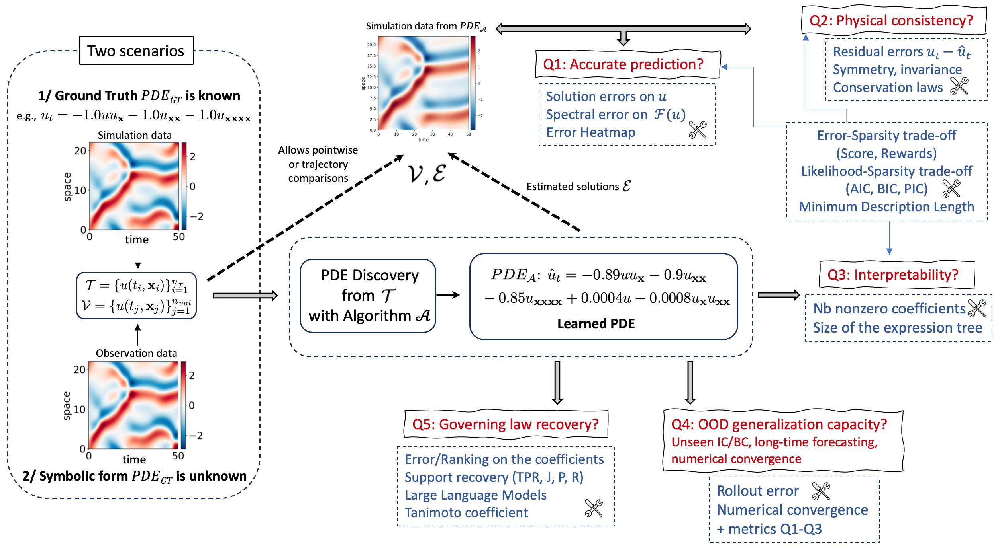
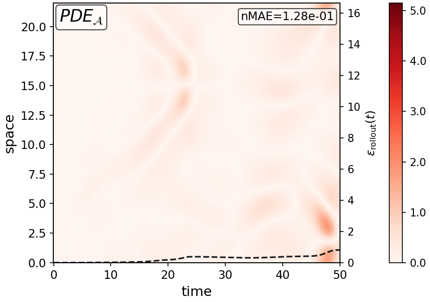
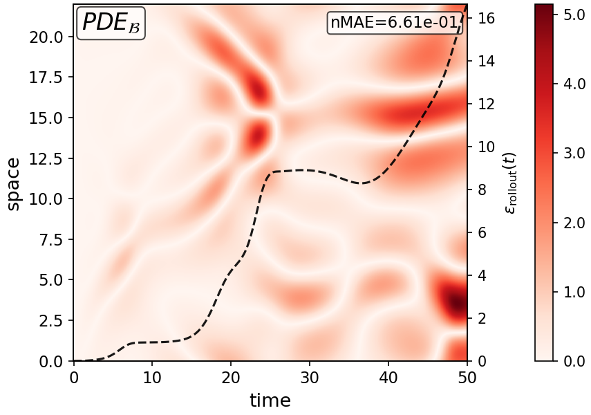
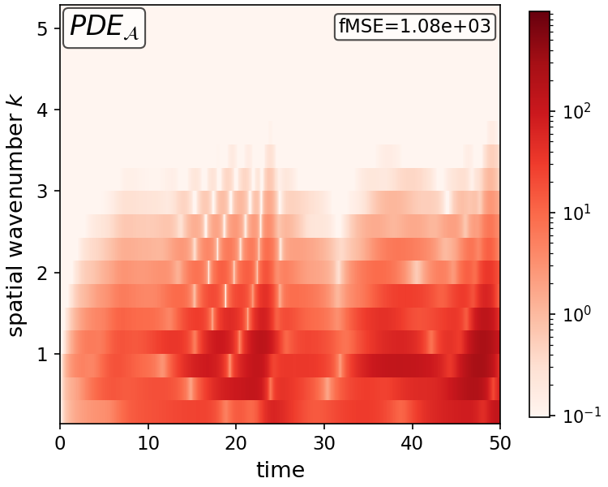
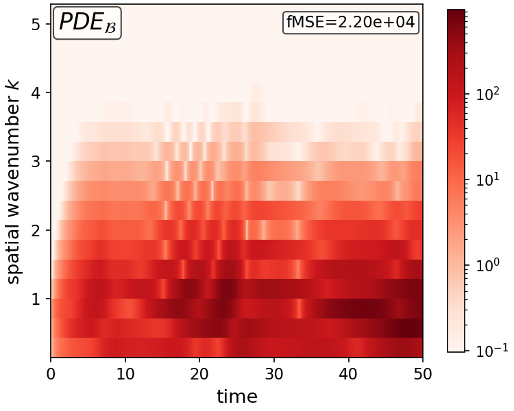

# PDE-Evaluation

Code associated with the paper:

> **On the post-hoc Evaluation of PDE Discovery: A Multifaceted Challenge of Scientific
> Advancement**
> Baptiste Mathevon, Farah Cherfaoui, Amaury Habrard, Marc Sebban

<details>
<summary><b>Abstract</b></summary>
<br>

Partial differential equation (PDE) discovery aims to identify from data the
governing law of a physical system. Constituting a cornerstone of scientific advancement, it
has become during the past decade a major line of research in the rapidly evolving field of
Physics-informed Machine Learning (PiML). Among the remaining open problems to address in this
domain, the post-hoc evaluation of discovered PDEs raises the particular difficulty of being
multifaceted. Indeed, it requires jointly considering predictive accuracy, physical
consistency, interpretability, and out-of-distribution generalization capacity. Given that some
of these properties are conflicting, it is worth noting that the wide range of existing
evaluation metrics only partially address the overall problem, potentially leading to overly
interpreted conclusions about the validity of a presumed new physical theory. From an abundant
literature spanning machine learning, numerical analysis, information theory or symbolic
regression, we propose, to our knowledge, the first taxonomy of PDE evaluation metrics, and
discuss their advantages and limitations in depth. Based on the observation that evaluation is
often achieved on a case-by-case basis and that a universally accepted methodology remains
elusive, we further provide recommendations with the aim of promoting standardized and reliable
practices, before sketching promising future lines of research in this field. We argue that
this paper is intended both for ML experts who design new PDE discovery algorithms and for
users of these methods aiming, in real applications, to discover and validate well-founded
scientific laws.

</details>

Post-hoc evaluation of PDE discovery: a suite of metrics and diagnostic plots for assessing
the quality of a *discovered* PDE against a known ground-truth PDE.

Given a candidate equation, e.g. `u_t = -u·u_x + 0.05·u_xx`, this repository simulates it,
compares it against the reference dynamics, and reports quantitative metrics (accuracy,
sparsity, coefficient recovery, generalization, trade-off scores) together with diagnostic
figures (solution fields, error heatmaps, spectral error, convergence curves).

Three reference systems are provided: **Burgers' equation**, the **Korteweg-de Vries (KdV)
equation**, and the **Kuramoto-Sivashinsky (KS) equation**.

### Open questions in the post-hoc evaluation of PDE discovery



## Repository structure

```
utils.py                       ETD1 spectral solver and PDE-file parsing, shared by all entry points
simulation.py                  entry point for figure generation
evaluation/evaluation.py       entry point for metric computation
evaluation/errors.py           accuracy metrics (MSE, nMAE, rollout error, ...)
evaluation/coef.py             coefficient-recovery metrics (NDCG, Tanimoto, ...)
evaluation/sparsity.py         sparsity and structural-complexity metrics
evaluation/tradeoff.py         accuracy-sparsity trade-off metrics (AICc, BIC, MDL, ...)
evaluation/generalization.py   out-of-distribution and numerical-convergence metrics
evaluation/shared.py           helper routines shared across metric modules
evaluation/sensitivity.py      term-sensitivity weighting used by the wL2coef metric
```

## PDE file format

A PDE is specified as a plain-text file listing its terms and coefficients:

```
u_xx: 0.05
u·u_x: -1.0
```

which corresponds to `u_t = 0.05·u_xx - u·u_x`. Supported terms are `u`, `u_x`, `u_xx`,
`u_xxx`, `u_xxxx` (linear terms), products of two such terms (quadratic terms, e.g. `u·u_x`),
and `x·u_xx`-style terms (a linear term multiplied by the spatial coordinate). A constant
offset may be specified with `b: <value>`.

Files are expected under `pde_files/<system>/`, named `<system>_pde_<tag>.txt`, e.g.
`pde_files/ks/ks_pde_true.txt` for the ground truth and `pde_files/ks/ks_pde_A.txt` for a
candidate. This convention is not required — files may be given by full path — but it is what
enables the `--file <system>` shortcut described below.

## Computing metrics

```
cd evaluation
python3 evaluation.py --file ks_pde_A.txt --metric all
```

This simulates the ground truth (`ks_pde_true.txt`, resolved automatically from the same
directory) and the candidate `ks_pde_A.txt`, then reports every registered metric.

Multiple candidates may be evaluated against the same ground truth in one call:

```
python3 evaluation.py --file ks_pde_A.txt ks_pde_B.txt --metric all
```

Individual metrics can be selected in place of `all`, either by name or by module (which
expands to all metrics defined in that module):

```
python3 evaluation.py --file ks_pde_A.txt --metric MSE rollout Sterms
python3 evaluation.py --file ks_pde_A.txt --metric errors coef
```

Some metrics require additional arguments; the script reports which one is missing if omitted:

```
python3 evaluation.py --file ks_pde_A.txt ks_pde_B.txt --metric Sterms --theta_size 5
python3 evaluation.py --file ks_pde_A.txt ks_pde_B.txt --metric Score --baseline_file ks_pde_A.txt
```

If a single system name is given instead of a filename, every candidate found for that system
is evaluated against its ground truth:

```
python3 evaluation.py --file ks --metric all --theta_size 5 --baseline_file ks_pde_A.txt
```

Additional options include `--dt_factor` (finer internal time-stepping), `--T_max`
(simulation horizon), `--k_max` (spectral cutoff for fMSE), `--ic` (choice of out-of-distribution
initial condition for `IC_nMAE`), and `--n_refine` (number of refinement steps for
`Conv_t`/`Conv_x`). See `python3 evaluation.py --help` for the complete list.

## Generating figures

```
python3 simulation.py --file ks_pde_A.txt
```

Produces a side-by-side comparison of the ground truth and candidate solution fields, a
solution heatmap, and an error heatmap, written to `simulations/` and `errors/`.

Example rollout-error (`--rollout`) and Fourier-space error (`--fourier`) plots for two KS candidates:

<p>




</p>

Additional options:

```
python3 simulation.py --file ks_pde_A.txt ks_pde_B.txt --eq_title      # annotate each panel with its equation
python3 simulation.py --file ks_pde_A.txt --rollout --rollout_t 300    # rollout-error plot, reported at t=300
python3 simulation.py --file ks_pde_A.txt --fourier --fourier_log      # spectral (Fourier-space) error heatmap
python3 simulation.py --file ks_pde_A.txt --conv --n_refine 6          # numerical convergence plots
python3 simulation.py --file ks --clean                                # all candidates for a system, unlabeled axes
```

## Requirements

`numpy`, `matplotlib`. `evaluation/sensitivity.py` additionally requires `jax`, used only by
the `wL2coef` metric.

## List of metrics

| Metric | Module | Description |
|---|---|---|
| `MSE` | `errors` | Mean squared error between candidate and ground-truth solutions |
| `nMSE` | `errors` | MSE normalized by the ground truth's squared magnitude |
| `nMAE` | `errors` | Mean absolute error normalized by the ground truth's magnitude |
| `n_utMSE` | `errors` | Normalized MSE on the residual `u_t` (RHS) instead of `u` |
| `fMSE` | `errors` | Mean squared error in Fourier space, over the meaningful wavenumber band |
| `rollout` | `errors` | Time-averaged L2 error between candidate and ground-truth trajectories |
| `nL2coef` | `coef` | Normalized L2 error between candidate and ground-truth coefficient vectors |
| `nL1coef` | `coef` | Normalized L1 error between candidate and ground-truth coefficient vectors |
| `maxerror` | `coef` | Largest relative coefficient error over the ground truth's nonzero terms |
| `NDCG` | `coef` | Ranking similarity of coefficient magnitudes (discounted cumulative gain ratio) |
| `wL2coef` | `coef` | L2 coefficient error weighted by each term's sensitivity (`dU/dalpha`) |
| `Tanimoto` | `coef` | Tanimoto/Jaccard-style similarity between coefficient vectors |
| `Sterms` | `sparsity` | Fraction of nonzero coefficients relative to the full candidate dictionary |
| `ExpTree` | `sparsity` | Size (node count) of the equation's expression tree |
| `Score` | `tradeoff` | Accuracy-per-complexity gain of the candidate relative to a baseline PDE |
| `Reward1` | `tradeoff` | Sparsity-weighted R² fit on the `u_t` residual |
| `Reward2` | `tradeoff` | Sparsity/depth-penalized inverse residual error |
| `AICc` | `tradeoff` | Corrected Akaike Information Criterion (fit vs. sparsity trade-off) |
| `BIC` | `tradeoff` | Bayesian Information Criterion (fit vs. sparsity trade-off) |
| `MDL_Fey` | `tradeoff` | AI-Feynman-style minimum description length score |
| `MDL_Sym` | `tradeoff` | SymLang-style minimum description length score |
| `IC_nMAE` | `generalization` | nMAE between candidate and ground truth under an unseen initial condition |
| `rollout_OOD` | `generalization` | Rollout error evaluated over a longer (out-of-distribution) horizon |
| `Conv_t` | `generalization` | Numerical convergence of the candidate PDE as the time step shrinks |
| `Conv_x` | `generalization` | Numerical convergence of the candidate PDE as the spatial grid is refined |

Each module name above can be passed directly to `--metric` to select all of its metrics at
once (e.g. `--metric errors`), as described in [Computing metrics](#computing-metrics).
